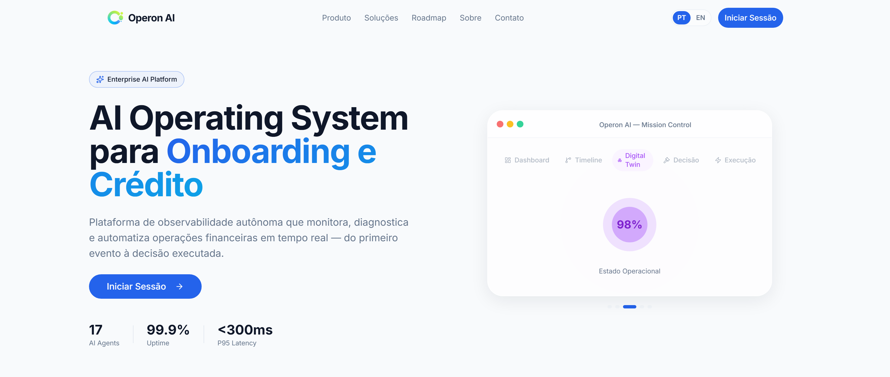

# Operon AI

### *Because an operation you cannot see is an operation you cannot fix.*

**AI Operating System for onboarding and credit operations.**

 

 

---

## ✦ About

> **Operon AI** monitors, diagnoses and automates financial operations in real time — from the raw event to the executed, audited and learned decision.

Onboarding and credit run across a chain of external providers: OCR, KYC, AML, bureaus, core banking. When one of them degrades, the damage is silent. SLAs slip, cases pile up, customers drop off, and nobody finds out until the monthly report.

---

## ✧ The Problem

> Financial operations are **observed in dashboards**,
> but they are **decided in the dark**.

- ◦ **Fragmented visibility** — each provider has its own console, none has the whole picture
- ◦ **Reactive diagnosis** — root cause is found days after the SLA is already broken
- ◦ **Untested decisions** — actions go straight to production without a what-if
- ◦ **Unauditable AI** — recommendations arrive with no evidence, no lineage, no accountability

---

## ✦ How It Works

A **closed loop**. The last stage feeds the first — each cycle makes the next diagnosis sharper.

Six layers sit under those six stages:

| Layer | Responsibility |
|-------|----------------|
| **Observation** | Events, Cases, Documents, Connectors |
| **Intelligence** | Evidence, Hypotheses, Causal Relations |
| **Testing** | Scenarios, What-If, Comparison |
| **Decision** | MCDA, Governance, Consensus |
| **Automation** | Execution Plans, Connectors, Sandbox |
| **Learning** | Operational DNA, Baselines, Memory |

---

## ✧ Digital Twin & AI Workforce

Agents do not act alone. Each holds a **contract** defining its mission, allowed services and constraints. They **vote**, their **conflicts** are recorded and resolved, and a **Decision Constitution** — weighted principles plus mandatory constraints — bounds what the collective is allowed to approve.

---

## ✦ Mission Control

The console behind the twin, organized by what you are trying to do:

| Group | Modules |
|-------|---------|
| **Monitor** | Operational Dashboard · Live Pipeline · Timeline · Cases · Customers · Documents · Connectors · Events · Alerts |
| **Understand** | Diagnosis · Evidence · Hypotheses · Operational Map · Impact · Operational Health · Operational Memory |
| **Simulate** | Scenarios · Comparison · ROI · Sensitivity · Reports |
| **Decide** | Decision Board · Ranking · Tradeoffs · Approvals · History · ADP Explorer · Constitution · Approval Matrix |
| **Automate** | Automation Hub · Execution Console · Connector Explorer · Scenario Library |
| **AI Center** | AI Workforce · Agent Registry · Agent Consensus · Agent Monitor · Playground · Human Review |
| **Platform** | Gateway · Services · Contracts · Capabilities · Artifacts · Prompts · Policies · Health · Costs |

Dedicated workspaces for **Onboarding**, **Credit**, **Fraud** and **Compliance**, with role-aware navigation — an executive, an operator and a compliance officer each see the surface that belongs to them.

---

## ✧ Integrations

---

## ✦ A Real Incident, End to End

| Step | What Operon AI does |
|------|---------------------|
| **1 · Problem** | AML provider latency at 1,200 ms against an 800 ms P95 baseline — 12 cases affected, 3 SLAs breached. |
| **2 · Diagnosis** | Evidence engine finds progressive degradation over 7 days, correlated with a provider update. **87% confidence, 5 supporting pieces of evidence.** |
| **3 · Simulation** | What-if: route 50% of traffic to the secondary provider → **35% lower average latency**. |
| **4 · Recommendation** | Dynamic 50/50 routing for the AML stage, with estimated ROI, implementation cost and projected SLA impact attached. |
| **5 · Governance** | The action goes to the approval matrix. Agents vote, conflicts surface, a human signs off. |
| **6 · Execution** | Plan → Apply → Verify, with the operational state visible at each step and rollback available. |

Every step is a screen you can open, drill into and export.

---

## ✧ The Differential

<table>
<tr>
<td width="50%" valign="top">

### ❌ Traditional observability

- Dashboards that show *what* broke
- Root cause found by a human, days later
- Actions applied straight to production
- Audit reconstructed after the fact

</td>
<td width="50%" valign="top">

### ✅ Operon AI

- An engine that explains *why* it broke
- Automatic hypotheses with confidence scores
- Every action simulated before it runs
- Immutable audit trail, built in by design

</td>
</tr>
</table>

---

## ✦ Governance & Trust

| | |
|--|--|
| 🔐 | **LGPD Compliant** — full adherence to Brazilian data protection law |
| 📜 | **Audit Trail** — complete trail with immutable evidence |
| 🛡️ | **Enterprise Security** — encryption in transit and at rest, granular RBAC |
| 🌍 | **Multi-Region** — distributed architecture for low global latency |

On top of that, an **AI governance suite**: model registry, prompt registry, evaluations, experiments, incidents, cost tracking and a trust center. If an agent made a call, you can trace which model, which prompt, which policy and which evidence produced it.

---

## ✧ Technologies

PocketBase backs it with a versioned migration chain covering connectors, evidence, intelligence, simulation, multi-agent, integration layer, AI governance, decision platform and automation. The interface is bilingual PT/EN, with a command palette and a guided Mission Control narrative mode.

---

## ✦ Roadmap

| Quarter | Milestone | Status |
|---------|-----------|--------|
| **Q1 2026** | Platform Launch — observability core, evidence & hypothesis framework, real-time pipeline | ✅ Done |
| **Q2 2026** | Multi-Agent Orchestration — specialist agents, consensus & voting, conflict resolution | 🔄 Active |
| **Q3 2026** | Advanced Testing — digital twin modeling, what-if builder, sensitivity analysis | ⏳ Planned |
| **Q4 2026** | Global Scale — multi-region deployment, enterprise SSO & SCIM, custom model fine-tuning | ⏳ Planned |

---

## ✧ Purpose

> ### *Operations should not be watched. They should be understood, tested, decided and learned from.*

---

## ✦ Contact & Links

 

Built for the operations that cannot afford to find out tomorrow.

